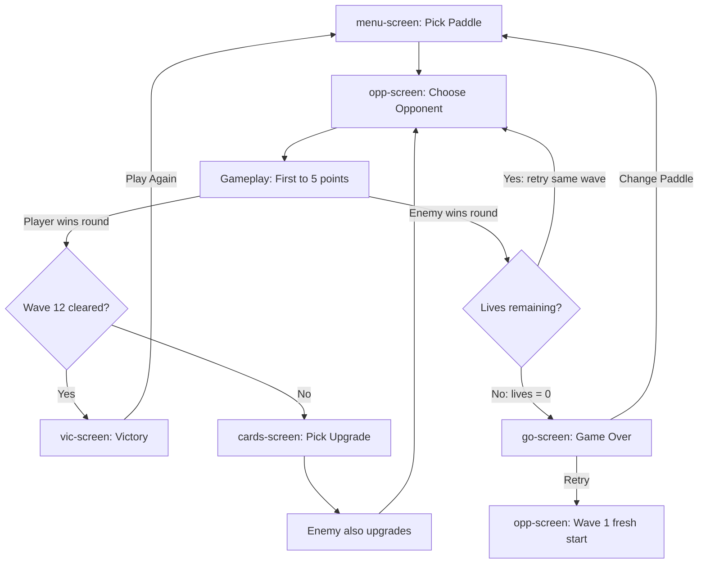

# Game Flow & State Management — PONG ROGUE

## Screen System

Six overlay screens managed by [`showScreen(id)`](script.js:1251) at line 1251. When a screen is shown, all others get `hidden` class (opacity 0, no pointer events). When `id === null`, the canvas is shown for gameplay.

### Screen IDs

| Screen ID | Purpose | Defined in HTML |
|-----------|---------|-----------------|
| `menu-screen` | Paddle selection (start of game) | Line 14 |
| `cards-screen` | Upgrade/reward selection (between waves) | Line 24 |
| `opp-screen` | Opponent difficulty selection (before each wave) | Line 57 |
| `go-screen` | Game Over screen (all lives lost) | Line 36 |
| `vic-screen` | Victory screen (cleared all 12 waves) | Line 48 |
| `dev-screen` | Dev mode (test any paddle vs any enemy) | Line 68 |
| `null` | Gameplay canvas active | — |

## Complete Game Flow

## State Lifecycle

### 1. Paddle Selection (menu-screen)

[`buildPadGrid()`](script.js:1292) builds the paddle selection UI. On click:
- Resets: `savedState = null`, `wave = 1`, `enemyUps = []`
- Sets `padId` to selected paddle
- Transitions to opponent selection

### 2. Opponent Selection (opp-screen)

[`showOpponentSelect()`](script.js:1383) at line 1383:
- Calls [`generateOpponents(wave)`](script.js:1331) to create 3 choices:
  - **EASY**: one rank below base, never boss
  - **NORMAL**: base rank, boss on schedule (wave % 3 === 0 for wave > 2)
  - **HARD**: two ranks above base, boss for wave > 1
- Each card shows: difficulty rank, enemy name/tag, ability, stats (SPD/IQ/SZ), available reward tiers
- On click: sets `chosenOppCfg = cfg`, calls `startWave()`

### 3. Wave Start

[`startWave(padId, wave)`](script.js:1253) at line 1253:
- Creates game state via [`newGame()`](script.js:214)
- Passes `savedState` (carried abilities/stats), `enemyUps` (accumulated enemy buffs), `chosenOppCfg`
- Hides all screens, shows canvas
- Boss waves play boss SFX

### 4. Gameplay

- [`update(dt)`](script.js:282) runs each frame when `curScreen === null && g`
- [`draw(ctx, cw, ch)`](script.js:816) renders each frame
- Game ends when either side reaches `PTS_WIN` (5 points)
- `g.done = true`, `g.result = 'win' | 'lose'`
- After done animation, player clicks/presses Enter → [`handleContinue()`](script.js:1277)

### 5. Round Resolution

[`handleContinue()`](script.js:1277) at line 1277:

**If player won:**
1. `savedState = saveGame(g)` — persists all stats and abilities
2. Increments wave
3. If `wave > MAX_WAVE` (12): show victory screen
4. Otherwise: generates 3 upgrade cards via `getCardsForDiff()`, picks random enemy upgrade → show upgrade screen

**If enemy won:**
1. Decrements lives (already done in scoring logic)
2. If `lives <= 0`: show game over
3. If `lives > 0`: carry remaining lives in savedState, return to opponent selection (retry same wave)

### 6. Upgrade Selection (cards-screen)

[`showUpgradeScreen(rewardTier, clearedDiff)`](script.js:1294) at line 1294:
- Shows difficulty badge + reward tier label
- Shows enemy upgrade warning (what buff enemy gets)
- Displays 3 upgrade cards
- On card click:
  1. Applies card's `fn()` to a spread of `savedState`
  2. Adds enemy upgrade to `enemyUps`
  3. Transitions to opponent selection for next wave

## Save State Object

[`saveGame(g)`](script.js:279) at line 279 serializes:
- Stat values: `bs`, `ph`, `pSpd`, `cdMul`, `horizMul`, `lives`, `shields`, `aiMod`
- All boolean abilities: ~25 properties including `edge`, `rico`, `magnet`, `dblScore`, `vampire`, `freeze`, `afterimage`, `shockwave`, `homing`, `timewarp`, `multicast`, `transcend`, `doppel`, `singularity`, `siphon`, `stormCaller`, `phantomStrike`, `mirrorMatch`, `berserker`, `overcharge`, `masterSkill`

## Game State Object (g)

Created by [`newGame()`](script.js:214). This is the largest object in the game. Major sections:

### Core gameplay
- `padId`, `pad` — selected paddle ref
- `cfg` — wave configuration (enemy, difficulty, AI params)
- `t` — elapsed time
- `bx`, `by`, `bvx`, `bvy` — ball position/velocity
- `px`, `py` — player paddle position
- `ey` — enemy paddle Y position
- `pScore`, `eScore` — round scores

### Movement/physics  
- `bs` — ball base speed
- `ballSpd` — current ball speed (rally-adjusted)
- `rallyBase`, `rallyHits` — rally acceleration tracking
- `pSpd` — paddle speed
- `pVelY`, `prevPy` — paddle velocity tracking for momentum transfer

### Ability state
- All boolean flags from savedState
- Active timers: `foresightT`, `blizzardT`, `freezeT`, `abCD`, etc.
- Projectile arrays: `bolts`, `multiBalls`
- Object refs: `afterBall`, `gravWell`, `placedWall`

### Enemy ability state
- `eAbil` — ability definition object
- `eAbilCD` — cooldown (starts at 2s)
- `eAbilPhase` — `'idle'` | `'channel'` | `'strike'`
- Ability-specific: `ltChannel`, `ltStun`, `bulkT`, `pullT`, `cloneT`, etc.

### Visual state
- `shake`, `shX`, `shY` — screen shake
- `flash`, `flashCol` — screen flash
- `hitFlash`, `scoreFlash` — HUD flash effects
- `chromaShift` — chromatic aberration intensity
- `ghostA` — ghost enemy paddle opacity
- `sparks` — particle array
- `trail` — ball trail positions

### Meta
- `done` — round complete flag
- `result` — `'win'` | `'lose'`
- `doneT` — time since done (for animation)
- `lives` — remaining lives
- `shields` — auto-block charges
- `combo` — consecutive player hits

## Dev Mode

[`showDevScreen()`](script.js:1457) at line 1457:
- Select any paddle and any enemy
- Toggle boss mode
- Set wave level (1–12)
- [`devLaunch()`](script.js:1502) creates a one-off game with chosen settings
- Resets `savedState`, `enemyUps` — no progression, just a test fight

## Input Handling

[`js/input.js`](js/input.js) and [`js/main.js`](js/main.js):
- `W/S` or `↑/↓` — vertical movement
- `A/D` or `←/→` — horizontal movement
- `Shift` or `Space` — **focus mode** (hold to slow movement to 40% for precision)
- `Q` — activate ability
- `Enter` — continue/advance after round
- Click on canvas — same as Enter
- Arrow keys and space have `preventDefault` to avoid scroll

### Focus Mode
When holding Shift or Space, player movement speed is reduced to 40% (`FOCUS_SPEED_MULT`), allowing for precision positioning. A dashed border visual indicator appears around the paddle when focus is active.
